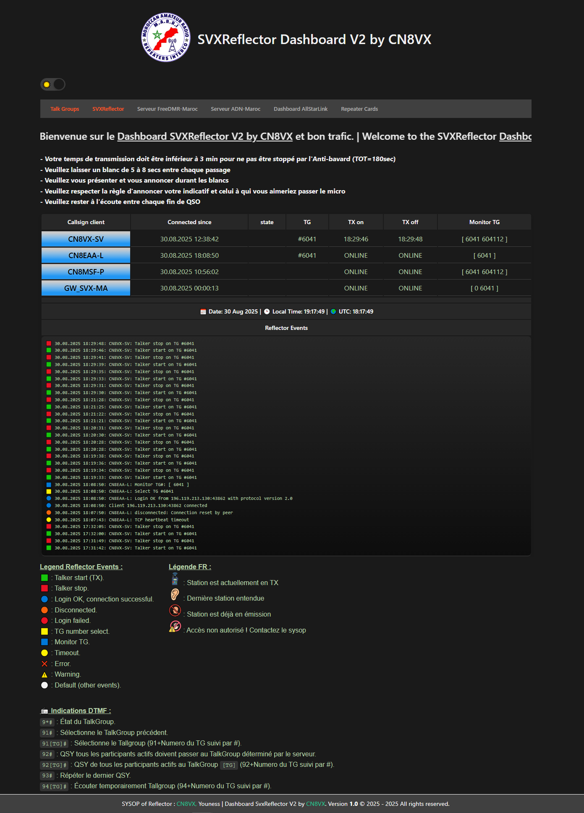
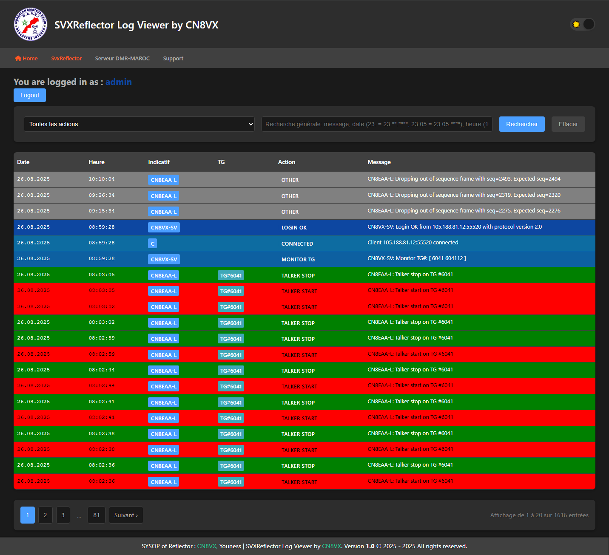

# Dashboard SVXReflector V2 by CN8VX

##  English
**Dashboard SVXReflector V2** is the second improved version of the *Dashboard SvxReflector by CN8VX*.  
This version isn't just an update, but a **complete redesign** with many improvements and new features.

### 🚀 Main improvements:
- **Modern GUI** with a new responsive navbar  
- **Merged CSS files** for cleaner structure  
- **Smart filters** to display only important messages in the **Reflector Events** section  
- **SVXReflector Log Viewer** page (password protected, only for sysops and authorized users)  
- **Colorful Log Display** to display logs with a modern interface and colors according to the type of action. 

### ⚙️ Compatibility
**Dashboard SVXReflector V2** is compatible only with **SvxLink version 2 (24.02)** and later, on **Debian 11, 12** and newer.

---

##  Français
**Dashboard SVXReflector V2** est la deuxième version améliorée du *Dashboard SvxReflector by CN8VX*.  
Ce n'est pas une simple mise à jour, mais une **refonte complète** avec de nombreuses améliorations et nouvelles fonctionnalités.

### 🚀 Principales améliorations :  
- **Interface graphique moderne** avec une nouvelle barre de navigation responsive  
- **Fusion des fichiers CSS** pour une structure plus claire  
- **Filtres intelligents** permettant d'afficher uniquement les messages importants dans la section **Reflector Events**  
- **Page SVXReflector Log Viewer** (protégée par mot de passe, accessible uniquement aux sysops et utilisateurs autorisés)  
- **Affichage coloré des logs** pour affiche les journaux avec une interface moderne et des couleurs selon le type d’action.  

### ⚙️ Compatibilité
**Dashboard SVXReflector V2** est compatible uniquement avec **SvxLink version 2 (24.02)** et ultérieures, sous **Debian 11, 12** et versions ultérieures.

---

## 📥 Installation
-  [Installation documentation in English](docs/README_EN.md)  
-  [Documentation d’installation en Français](docs/README_FR.md)

---

### 📊 Screenshots / Captures d’écran

### Dashboard SVXReflector V2

### SVXReflector Log Viewer

---

## 🛠 Author / Auteur
Developed by / Développé par **CN8VX**
